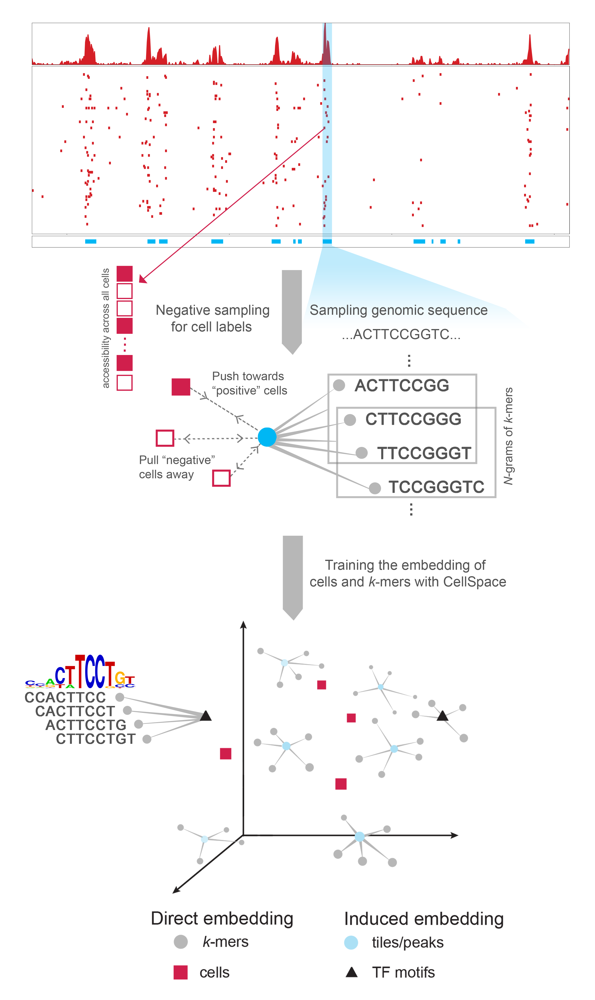

# CellSpace

**\*\* This repository is currently undergoing changes as we update CellSpace and develop a more comprehensive documentation. We appreciate your patience! \*\***

CellSpace is an efficient and scalable sequence-informed embedding method for scATAC-seq that learns a mapping of DNA *k*-mers and cells to the same space.

See our [pre-print](https://www.biorxiv.org/content/10.1101/2022.05.02.490310v3.full.pdf) for more details.

In order to learn a CellSpace embedding for scATAC-seq data, you will need to compile and run the [C++ code](cpp/). We use [R](R/) for downstream analyses.

<p align="center">

 <br> Learning a CellSpace embedding from single-cell ATAC-seq data.

</p>

## Citation

Please cite the [arXiv paper](https://doi.org/10.1101/2022.05.02.490310) if you use CellSpace:

```         
@article {Tayyebi2022.05.02.490310,
    author = {Tayyebi, Zakieh and Pine, Allison R. and Leslie, Christina S.},
    title = {Scalable sequence-informed embedding of single-cell ATAC-seq data with CellSpace},
    elocation-id = {2022.05.02.490310},
    year = {2022},
    doi = {10.1101/2022.05.02.490310},
    publisher = {Cold Spring Harbor Laboratory},
    URL = {https://doi.org/10.1101/2022.05.02.490310},
    journal = {bioRxiv}
}
```

## Contact

-   [zakieh.tayyebi\@gmail.com](mailto:zakieh.tayyebi@gmail.com) (Zakieh Tayyebi)
-   [lesliec\@mskcc.org](mailto:lesliec@mskcc.org) (Christina S. Leslie, PhD)
