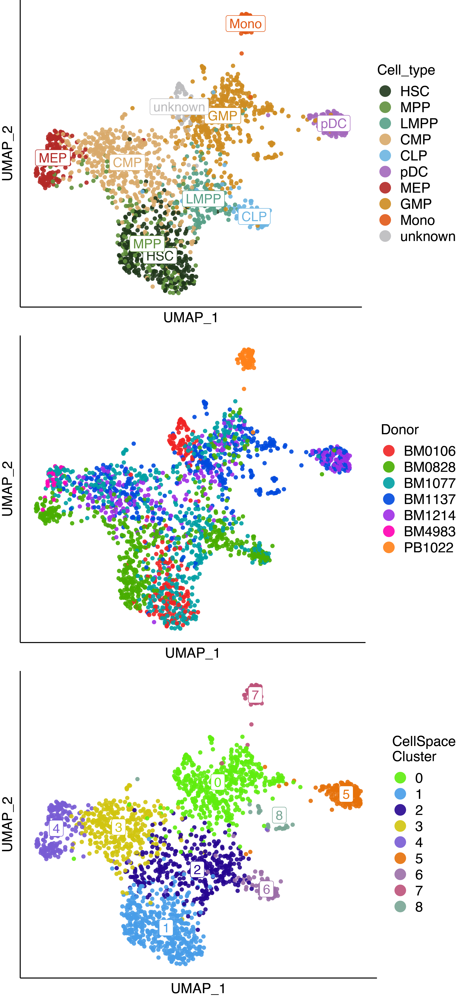
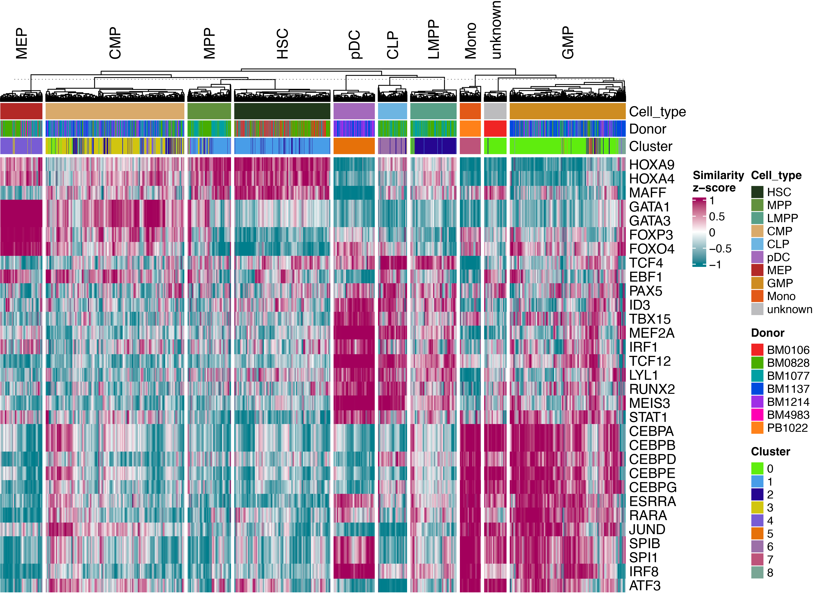
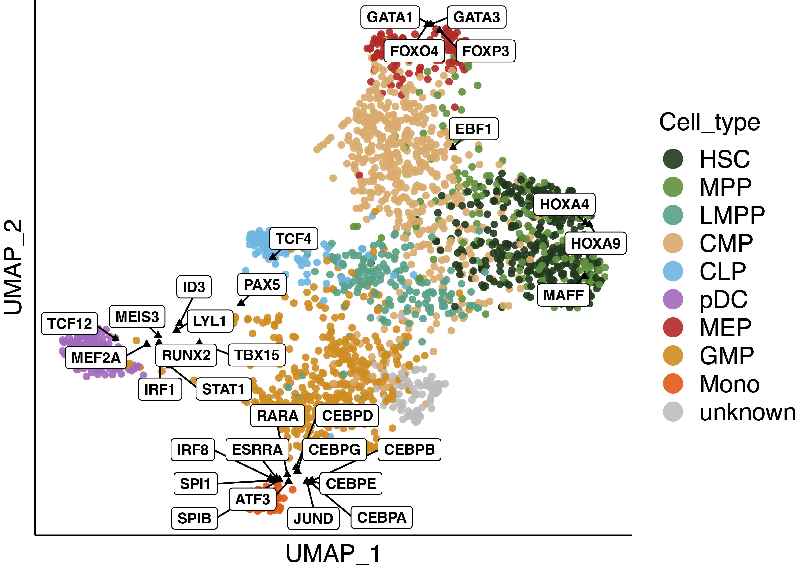

## Pre-processing scATAC-seq data

Learning a CellSpace embedding requires a cell-by-event matrix, where events are either an atlas of accessible peaks or genomic tiles, as well as the genomic sequences of the events.

If you want to follow the tutorial using our example dataset, 'Small-scale human hematopoiesis dataset' [[Buenrostro et al., 2018](https://doi.org/10.1016/j.cell.2018.03.074)], you can proceed to the next section and use the files in [data/](data/) after decompressing them:

``` bash
gunzip data/*.gz
```

### Using genomic tiles

The most convenient way of pre-processing your scATAC-seq data from scratch to train a CellSpace embeddding is using [ArchR](https://www.archrproject.com) [[Granja *et al.*, 2021](https://doi.org/10.1038/s41588-021-00790-6)] and exporting its top variable tiles (500bp genomic bins); so you will not need to deal with various peak-calling strategies, their biases, and manually filtering the peak atlas.

The scripts used to pre-process the 'Small-scale human hematopoiesis dataset' from scratch, as described in [our manuscript](https://www.biorxiv.org/content/10.1101/2022.05.02.490310v3.full.pdf), are available [here](variable-tiles/README.md). Once you have an ArchR object containing the pre-processed scATAC-seq data (named `archr.obj` here), you can perform iterative LSI and prepare the input files to train a CellSpace embedding.

Load required libraries:

``` r
library(ArchR)
library(Matrix)
library(dplyr)
library(GenomicRanges)
library(Biostrings)
library(BSgenome.Hsapiens.UCSC.hg19)
```

Perform iterative LSI to identify top 50K variable genomic tiles:

``` r
archr.obj <- addIterativeLSI(archr.obj, iterations = 5, varFeatures = 50000)
```

Extract the accessibility matrix for top variable tiles:

``` r
tile.mtx <- assays(getMatrixFromProject(archr.obj, useMatrix = "TileMatrix", binarize = T))$TileMatrix
var.tiles <- archr.obj@reducedDims$IterativeLSI$LSIFeatures[, -3]
var.tile.mtx <- tile.mtx[match(var.tiles, tile.mtx@elementMetadata), ]
```

Prepare input files for CellSpace:

``` r
genome <- BSgenome.Hsapiens.UCSC.hg19
tileSize <- archr.obj@reducedDims$IterativeLSI$tileSize
GRanges(
  seqinfo = seqinfo(genome),
  seqnames = var.tiles$seqnames, strand = "+",
  ranges = IRanges(start = var.tiles$start, width = tileSize)
) %>% getSeq(x = genome) %>% writeXStringSet(filepath = "data/var_tiles.fa")
gsub("^.+#", "", archr.obj$cellNames) %>%
  write(ncolumns = 1, file = "data/cell-names.txt")
writeMM(t(var.tile.mtx), file = "data/cell_by_tile-counts.mtx")
```

### Using a peak atlas

You can use CellSpace regardless of your pre-processing pipeline, but we suggest filtering lower-quality cells/peaks; in particular, peaks that are not accessible in any cells must be excluded!

We also suggest removing promoter-proximal peaks, since it's been demonstrated that promoter-distal regions show significantly higher cell-type-specificity than promoter-proximal regions [[Preissl *et al.*, 2018](https://doi.org/10.1038/s41593-018-0079-3)][[Chung *et al.*, 2019](https://doi.org/10.1016/j.celrep.2019.08.089)].

Additionally, using top variable peaks significantly reduces training time, while preserving or potentially improving the quality of the embedding. We have prepared [an **R** script](variable-peaks/IterativeLSI.R) based on [ArchR's iterative LSI method](https://www.archrproject.com/bookdown/iterative-latent-semantic-indexing-lsi.html) to identify top variable peaks, without the need for an ArchR object and its ArrowFiles. Please refer to [ArchR::addIterativeLSI](https://www.archrproject.com/reference/addIterativeLSI.html) for a detailed description of parameters.

The script used to filter the peak atlas of the 'Small-scale human hematopoiesis dataset', as described in [our manuscript](https://www.biorxiv.org/content/10.1101/2022.05.02.490310v3.full.pdf), is available [here](variable-peaks/filter-peaks.R). Once you have a peak-by-cell sparse count matrix of class **dgCMatrix** (named `counts` here) and its corresponding peak set of class **GRanges** (named `peaks.gr` here), you can perform iterative LSI and prepare the input files to train a CellSpace embedding.

Load required libraries and functions:

``` r
library(ArchR)
library(Matrix)
library(dplyr)
library(GenomicRanges)
library(Biostrings)
library(BSgenome.Hsapiens.UCSC.hg19)
source("variable-peaks/IterativeLSI.R")
```

Perform iterative LSI to identify top 50K variable peaks:

``` r
itLSI <- IterativeLSI(counts, iterations = 5, varFeatures = 50000)
var.peaks <- itLSI$LSIFeatures$idx
```

Prepare input files for CellSpace:

``` r
genome <- BSgenome.Hsapiens.UCSC.hg19
getSeq(peaks.gr[var.peaks], x = genome) %>%
  writeXStringSet(filepath = "data/var_peaks.fa")
write(colnames(counts), ncolumns = 1, file = "data/cell-names.txt")
writeMM(t(counts[var.peaks, ]), file = "data/cell_by_peak-counts.mtx")
```

## Training a CellSpace model

We will continue this tutorial using the variable genomic tiles and the corresponding count matrix prepared in the previous section.

Train a CellSpace embedding:

``` bash
CellSpace \
  -output data/CellSpace_embedding-var_tiles \
  -cpMat  data/cell_by_tile-counts.mtx \
  -peaks  data/var_tiles.fa
```

The result is a tab-delimited file containing the CellSpace embedding matrix for cells and DNA *k*-mers.

``` bash
CellSpace ...

The following arguments are mandatory:
  -output             prefix of the output
  -cpMat              sparse cell by peak/tile count matrix (.mtx)
  -peaks              multi-fasta file containing peak/tile DNA sequences with the order they appear in the corresponding count matrix (.fa)

The following arguments are optional:
  -dim                size of embedding vectors [default=30]
  -ngrams             max length of k-mer ngram [default=3]
  -k                  k-mer length [default=8]
  -sampleLen          length of the sequences randomly sampled from the peak/tile DNA sequences (integer or 'given') [default=150]
  -exmpPerPeak        number of training examples per peak/tile [default=20]
  -epoch              number of epochs [default=50]
  -margin             margin parameter in hinge loss [default=0.05]
  -bucket             size of the hashing map for n-grams [default=2000000]
  -label              cell labels prefix [default='__label__']
  -lr                 learning rate [default=0.01]
  -maxTrainTime       max train time (seconds) [default=8640000]
  -negSearchLimit     number of negative labels sampled per dataset [default=50]
  -maxNegSamples      max number of negative labels in a batch update [default=10]
  -p                  the embedding of an entity equals the sum of its M feature embedding vectors devided by M^p [default=0.5]
  -initRandSd         initial values of embeddings are randomly generated from normal distribution with mean=0 and standard deviation=initRandSd [default=0.001]
  -batchSize          size of mini batch in training [default=5]
  -saveIntermediates  save intermediate models or only the final model (integer or 'final') [default='final']
  -thread             number of threads [default=10]
```

-   In order to train CellSpace on multiple datasets, processed with respect to their own peak atlases, their input files must be provided as a list: `-cpMat data1-counts.mtx data2-counts.mtx -peaks data1-peaks.fa data2-peaks.fa`\
    CellSpace will avoid pushing cells from different datasets away from each other by sampling the peak, the positive cell, and the negative cells for each training example from the same dataset.
-   To get more compact clusters and an overall better embedding, specially for larger or more heterogeneous data sets, we suggest increasing `-epoch`. Increasing the size of *N*-grams will have a similar effect; however, we suggest the default `-ngrams 3` in most cases.
-   Running time will increase with the number of of events, so we suggest using top variable peaks or genomic tiles instead of a large peak atlas.
-   If `-sampleLen given` is specified, the entire peak/tile sequence is used for every training example; otherwise, a fixed-size sequence is randomly sampled from the event for each training example.
-   if `-saveIntermediates final` is specified, only the final model will be saved; otherwise, if `-saveIntermediates M` is specified, the model will be saved after every `M` epochs.
-   You can increase `-thread` to speed up the training process.

## Downstream analysis

Load required libraries and functions:

``` r
library(CellSpace)
library(TFBSTools)
library(JASPAR2020)
library(dplyr)
source("plot-functions.R")
```

Load CellSpace embedding:

``` r
cell.idx <- readLines("data/cell-names.txt")
sample.info <- read.table(
  file = "data/sample-info.tsv", sep = "\t",
  header = T, check.names = F, row.names = 1
)
pal <- readRDS("data/palette.rds")
sample.info$Cell_type <- factor(sample.info$Cell_type, levels = names(pal$Cell_type))

cso <- CellSpace(
  project = "tutorial",
  emb.file = "data/CellSpace_embedding-var_tiles.tsv",
  meta.data = sample.info[cell.idx, ]
)
```

The CellSpace embedding matrices are stored in `cso@cell.emb` and `cso@kmer.emb`.

Note that the order of cells in `meta.data` and `cell.names`, if provided to the constructor of a CellSpace object, must be the same as the count matrix provided to train the CellSpace model. If `cell.names` is not provided, the row names of `meta.data` will be used.

Create a shared nearest-neighbor graph for the cells, cluster the cells, and compute a UMAP embedding for cells, using wrappers of [Seurat](https://github.com/satijalab/seurat/tree/master) [[Hao, *et al.*, Cell 2021](https://doi.org/10.1016/j.cell.2021.04.048)] functions:

``` r
cso <- find_neighbors(cso, n.neighbors = 20) %>%
  find_clusters(resolution = c(0.8, 1.2)) %>%
  run_UMAP(n.neighbors = 20, min.dist = 0.2, spread = 1)
```

The nearest-neighbor (NN) and shared nearest-neighbor (SNN) graphs are stored in `cso@neighbors`, the clusters are added to `cso@meta.data`, and the UMAP is stored in `cso@reductions`.

`run_UMAP` uses the CellSpace embedding of cells by default; alternatively, you can provide the name of a pre-computed nearest neighbor graph in `cso@neighbors` to compute the UMAP embedding from.

Let's visualize the results:

``` r
plot.groups(
  cso, vis = "cells_UMAP", groups = "Cell_type",
  pal = pal$Cell_type, add.labels = T
)
plot.groups(
  cso, vis = "cells_UMAP", groups = "Donor",
  pal = pal$Donor, add.labels = F
)
plot.groups(
  cso, vis = "cells_UMAP", groups = "Clusters.res_1.2",
  pal = pal$Cluster, add.labels = T
) + labs(color = "CellSpace\nCluster")
```



You can map any valid DNA sequence that is not shorter than the *k*-mers (8bp by default) to the same embedding space, using `DNA_sequence_embedding`. The embedding of a transcription factor motif is computed using its consensus sequence:

``` r
pwm.list <- readRDS("data/PWM-list.rds") # example CIS-BP TF motifs
motif.emb <- lapply(pwm.list, function(pwm){
  motif_embedding(cso, PWM = pwm)
}) %>% do.call(what = rbind)
```

The cosine similarity/distance of CellSpace embedding matrices can be computed with `cosine_similarity`/`embedding_distance`; for example, the similarity between a TF motif and cell embedding vectors in the latent space represents TF activity scores:

``` r
motif.score <- cosine_similarity(x = cso@cell.emb, y = motif.emb) %>% scale()
```

Let's visualize the scores:

``` r
md <- cso@meta.data[, c("Cell_type", "Donor", "Clusters.res_1.2")]
colnames(md)[3] <- "Cluster"
plot.scores(t(motif.score), cell.annot = md, pal = pal, column_split = cso$Cell_type)
```



You can automatically perform these steps using `add_motif_db`:

``` r
jaspar <- getMatrixSet(JASPAR2020@db, opts = list(species = "Homo sapiens", collection = "CORE"))
names(jaspar) <- TFBSTools::name(jaspar)
cso <- add_motif_db(cso, motif.db = jaspar, db.name = "JASPAR2020")
```

The motif embedding matrix and the corresponding similarity *Z*-scores are stored in `cso@motif.emb` and `cso@misc`.

Let's visualize cells and TF motifs in the same space:

``` r
cso <- run_UMAP(
  cso, name = "cell&TFs_UMAP",
  emb = rbind(cso@cell.emb, motif.emb),
  n.neighbors = 50, min.dist = 0.2, spread = 1
)

TFs <- rownames(motif.emb)
TF.umap <- data.frame(cso@reductions$`cell&TFs_UMAP`)[TFs, ]
plot.groups(
  cso, vis = "cell&TFs_UMAP", groups = "Cell_type",
  pal = pal$Cell_type, add.labels = F
) +
geom_point(data = TF.umap, color = "black", shape = 17, size = 1.5) +
geom_label_repel(
  mapping = aes(label = TFs), data = TF.umap,
  size = 3, fontface = "bold", min.segment.length = 0,
  max.overlaps = Inf, segment.color = "black"
)
```


